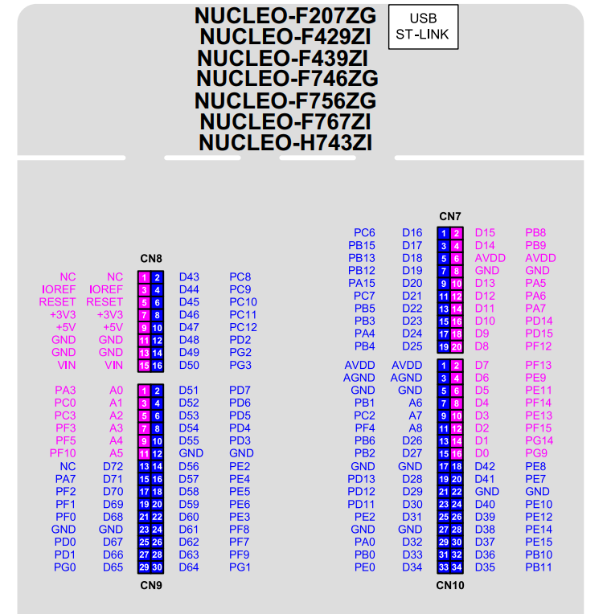

## This project runs LVGL with STM32F429 Nucleo and LCD ILI9488.
To run rgb mixer, uncomment this in main.c.
To run demo widget, uncomment this in main.c.
To run demo benchmark, uncomment this in main.c.
This project also use DMA to transfer data SPI.
SPI1 is used to transmit data image, SPI3 to transmit data touchpad.

## Connection:
### SPI 1 <-------> LCD:
LCD_RST 	PD14  
LCD_RS 		PD15
LCD_CS 		PF12
LCD_SCK 	PA5
LCD_MOSI 	PA7
LCD_MISO 	PA6 

### SPI 3 <-------> LCD:
TS_CS             PC9
TS_SCK            PC10
TS_MOSI           PC12
TS_MISO           PC11
TS_IRQ            PC8  

 
Demo widget: https://youtu.be/YhzNdz8crOY
 
Demo benchmark with DMA: https://youtu.be/qHp6eaYccfI

Demo benchmark without DMA: https://youtu.be/wb4hWXlK-wU

Demo RGB mixer: https://youtu.be/-JJ_3IZXAUo